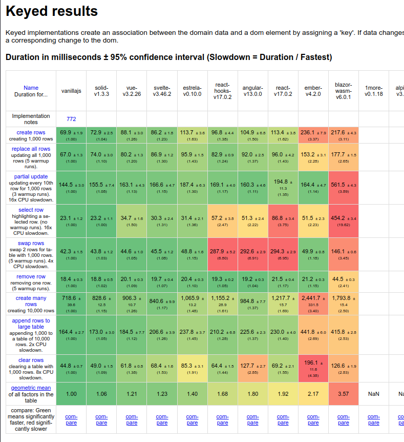

<h1 align="center">Estrela - Full Reactive Framework</h1>

<p align="center">
  
  <br>
  <p align="center">Estrela is a Javascript framework to develop reactive web apps.</p>
</p>

<p align="center">
  <a href="https://www.npmjs.com/package/estrela">
    
  </a>&nbsp;
</p>

<hr>

Estrela is extremely easy to use, all the hard work is done by the babel plugin. There's no need for hooks like `useState`, `useEffect` and others.

To create a state variable, just declare it using the `let` keyword to specify that its value will change in the future.

The component function will be called just once, so you can call any side effect directly in the function scope.

```tsx
// main.tsx
import { onDestroy, render } from 'estrela';

function App() {
  let count = 0;

  const interval = setInterval(() => count++, 1000);

  onDestroy(() => clearInterval(interval));

  return <Count count={count} />;
}

function Count(props: { count: number }) {
  return <div>Count is {props.count}</div>;
}

render(<App />, document.getElementById('app')!);
```

## Installation

Start a new Estrela project by running the following `degit` command:

```bash
$ npx degit estrelajs/template my-project-name
$ cd my-project-name

# using Yarn:
$ yarn
$ yarn dev

# or using NPM:
$ npm i
$ npm run dev
```

## Documentation

Check the [documentation](https://estrelajs.github.io/) for more information.

## Examples

See it in action on this [Todo App](https://estrelajs.github.io/estrela/todo) example. You can find source code for this example [here](https://github.com/estrelajs/estrela/tree/main/packages/playground/src/todo).

## Performance

Since version v0.10.0, Estrela uses a new dom manager system which boosted the performance of the application making it faster than React and Angular. Still have many things to polish to make it even faster.

This is a performance chart comparing Estrela to other famous frameworks:



## Contributing

Estrela is open source and we appreciate issue reports and pull requests.
