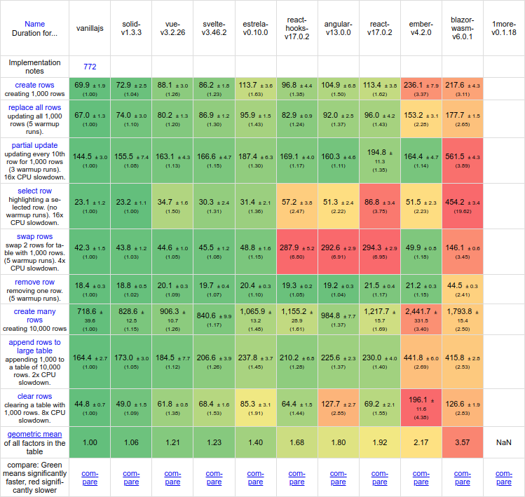

<h1 align="center">Estrela - Full Reactive Framework</h1>

<p align="center">
  
  <br>
  <p align="center">Estrela is a Javascript framework to develop reactive web apps.</p>
</p>

<p align="center">
  <a href="https://www.npmjs.com/package/estrela">
    
  </a>&nbsp;
  <a href="https://opensource.org/licenses/MIT" target="_new">
    
  </a>
</p>

<hr>
&nbsp;

Estrela is a modern TypeScript library inspired by popular frameworks such as React, Angular, and Solid. It provides a comprehensive set of features while leveraging reactive programming to create responsive and dynamic applications.

```tsx
// main.tsx
import { onDestroy, signal } from 'estrela';

function App() {
  const count = signal(0);

  const interval = setInterval(() => count.update(x => x + 1), 1000);

  onDestroy(() => clearInterval(interval));

  return <Count count={count()} />;
}

function Count(this: { count: number }) {
  return <div>Count is {this.count}</div>;
}

App().mount(document.getElementById('app')!);
```

## Key Features
- Reactive Signal-based Framework: Estrela's core architecture is built around signals, enabling reactive programming. Signals allow for efficient data flow and automatically update the UI whenever the underlying data changes.

- Main Functionalities: Estrela comes with all the essential functionalities you need to build robust applications. It provides components, lifecycle hooks, and utilities for managing state, handling events, and rendering user interfaces efficiently.

- Built-in Styling with CSS-in-JS: Estrela incorporates CSS-in-JS styling, allowing you to write component-specific styles directly in your TypeScript code. This approach promotes component encapsulation and eliminates the need for external CSS files.

- Router: The built-in router simplifies navigation within your application. It provides declarative routing capabilities, enabling you to define routes and associated components effortlessly.

- Store: Estrela includes a powerful store mechanism for managing global state. The store facilitates state sharing across components and ensures consistent and predictable updates throughout your application.

## Get Started

Start a new Estrela project by running the following `degit` command:

```bash
$ npx degit estrelajs/template my-project-name
$ cd my-project-name

# using Yarn:
$ yarn
$ yarn dev

# or using NPM:
$ npm i
$ npm run dev
```

## Documentation

Check the [documentation](https://estrelajs.github.io/) for more information.

## Examples

See it in action on this [Todo App](https://estrelajs.github.io/estrela/todo) example. You can find source code for this example [here](https://github.com/estrelajs/estrela/tree/main/packages/playground/src/todo).

## Performance

Since version v0.10.0, Estrela uses a new dom manager system which boosted the performance of the application making it faster than React and Angular. Still have many things to polish to make it even faster.

This is a performance chart comparing Estrela to other famous frameworks:



## Contributing

Estrela is open source and we appreciate issue reports and pull requests.

## License

Estrela is released under the MIT License. Feel free to use it in both open-source and commercial projects.
